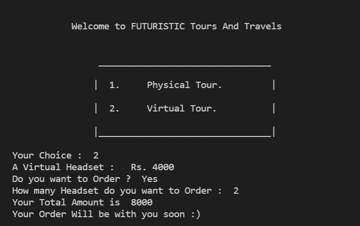
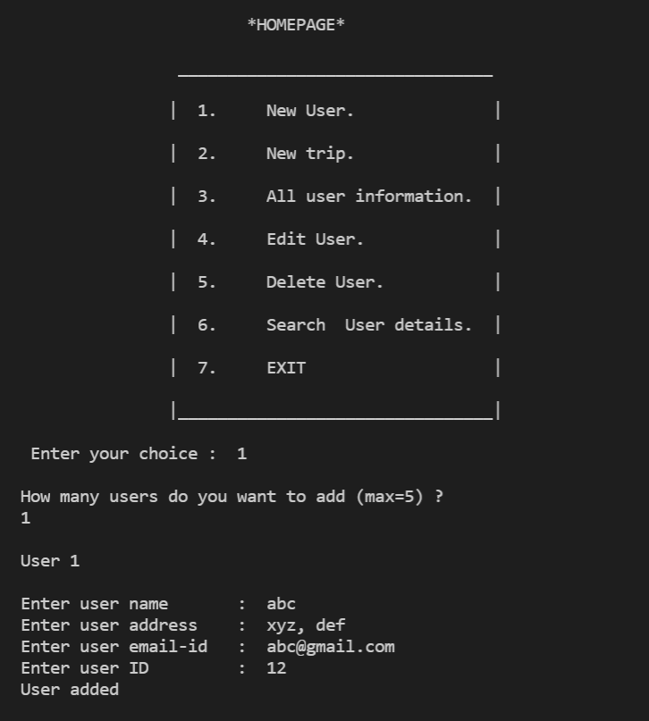
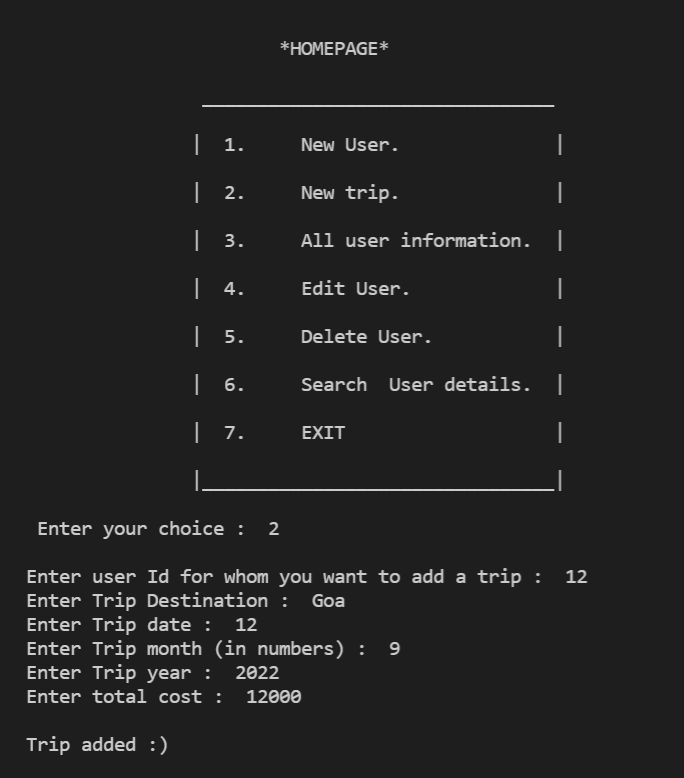
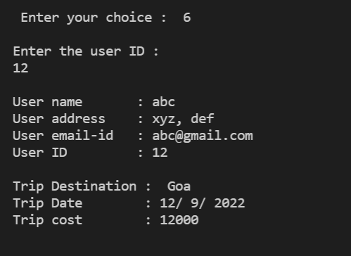
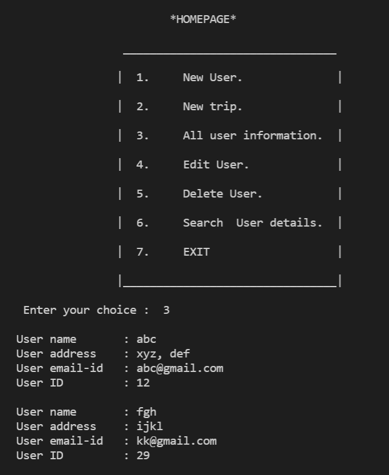

# Tours And Travels Database Management. 

### Introduction: 
I started working on this project back in my 12th grade in 2019, and it was my first major project in the world of programming. As this project is very special for me I never left working on it and kept improving it. This project is designed in C++ language using concepts like file handling, object-oriented programming, etc. 

### More About The Project: 
This project is tours and travels database management made for small vendors to help them store their customer data and make them more efficient. It first asks the vendor whether their client wants a Physical or a Virtual trip. If virtual is chosen it also asks if the client wants to purchase VR from the vendor or not. After the trip type is selected it displays a menu for the vendor to select from. The menu has options like input new client, new trip for a client, delete/update record of a particular client, etc. The program makes two binary files one for all the clients and one for all the trips for all the clients and performs all the operations in those files. 

### Images:

